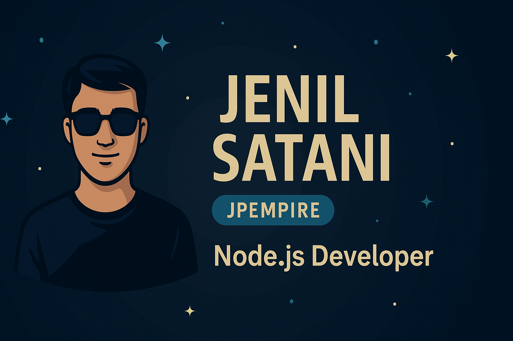

<h1 align="center">🌟 Jenil Satani Portfolio 🌟</h1>

  

<h2 align="center">🚀 Welcome to My Portfolio! 🚀</h2>

  

  

  
  
  

<!-- 

  

 -->

Welcome to my portfolio repository! I'm a passionate **Node.js Developer** with expertise in building scalable backend solutions and RESTful APIs. This repository showcases my projects, technical skills, and professional journey in software development.

## 🚀 About Me
Hi, I'm **Jenil Satani** (also known as **JPEMPIRE**), a dedicated **Node.js Developer** with a passion for creating robust, scalable applications. I specialize in backend development and love turning complex problems into simple, beautiful solutions.

<!-- 

  

 -->

### 🎯 What Drives Me
- 💻 **Problem Solving**: Finding elegant solutions to complex technical challenges
- 🚀 **Innovation**: Exploring cutting-edge technologies and best practices
- 🤝 **Collaboration**: Working with teams to build amazing products
- 📈 **Growth**: Continuously learning and improving my skills

## 🔥 What I Do
- 🌐 **Backend Development**: Building RESTful APIs with Node.js & Express.js  
- 🛢 **Database Management**: MongoDB, PostgreSQL, MySQL, Redis  
- ☁ **Cloud & DevOps**: Docker, AWS
- ⚡ **Performance Optimization**: Writing efficient & scalable code  
- 🔒 **Security**: Implementing secure authentication and authorization
- 📊 **API Design**: Creating well-documented and maintainable APIs
<!-- 

  

 -->

## 📂 Featured Projects

### 🚧 Coming Soon - Project Showcase
I'm currently working on some exciting projects that will be featured here soon! Stay tuned for:

- **E-Commerce API** - A comprehensive RESTful API with authentication, payment integration, and real-time features
- **Task Management System** - A collaborative project management tool with real-time updates
- **Social Media Backend** - A scalable backend for social networking applications

### 📁 Project Categories
- **Full-Stack Applications** - Complete web applications with frontend and backend
- **API Development** - RESTful and GraphQL APIs
- **Microservices** - Distributed system architectures
- **Open Source Contributions** - Community-driven projects

Check out more projects in the **[Projects](./projects)** directory.

  

## 📚 Currently Learning & Exploring
- 🔥 **GraphQL** - Modern API query language
- 🏗️ **Microservices Architecture** - Scalable system design
- 🚀 **Kubernetes & Serverless** - Cloud-native development
- 🔐 **Advanced Security** - OAuth 2.0, JWT, and security best practices
- 📊 **Data Analytics** - Big data processing and analytics

## 🛠️ Technical Skills

### 💻 Programming Languages

  
  

### 🏗️ Frameworks & Libraries

  
  
  

### 🗄️ Databases & Caching

  
  
  
  

### 🛠️ Tools & Technologies

  
  

<!-- 

  

 -->

## 📊 GitHub Analytics

  

  

  

### 🏆 GitHub Achievements

  

<!-- 

  

 -->

## 📫 Let's Connect!
I'm always open to discussing new opportunities, collaborations, or just having a chat about technology!
<!-- 

  

 -->

  
  
   
  

## 📜 Favorite Quote
> **"Code is like humor. When you have to explain it, it's bad."** – *Cory House*

## 🎯 What I'm Looking For
- 🚀 **Exciting Projects** - Opportunities to work on innovative solutions
- 🤝 **Collaborations** - Open source contributions and team projects
- 📚 **Learning** - Mentorship and knowledge sharing
- 💼 **Career Growth** - Full-time opportunities in backend development

<!-- 

  

 -->

  

<h3 align="center">🚀 "Any fool can write code that a computer can understand. Good programmers write code that humans can understand." – Martin Fowler 💡</h3>

## 🎥 Project Demos & Presentations
🚀 **Coming Soon** - Video demonstrations and technical presentations of my projects! 🚀

## ✍️ Technical Writing & Blog
🚀 **Coming Soon** - Articles about Node.js development, best practices, and technical insights! 🚀

## 🎉 Fun Facts About Me
- 💡 Always learning & improving!
- ☕ Coffee enthusiast and productivity seeker
- 🎮 Love exploring new technologies and frameworks
- 🌍 Passionate about open source and community contribution

<!-- 

  

 -->

---

### ⭐️ **Star this repository if you find my work interesting!**

### 📧 **Feel free to reach out for collaborations, opportunities, or just to say hello!**
<!-- 

  

 -->

---

*Last updated: December 2024*
