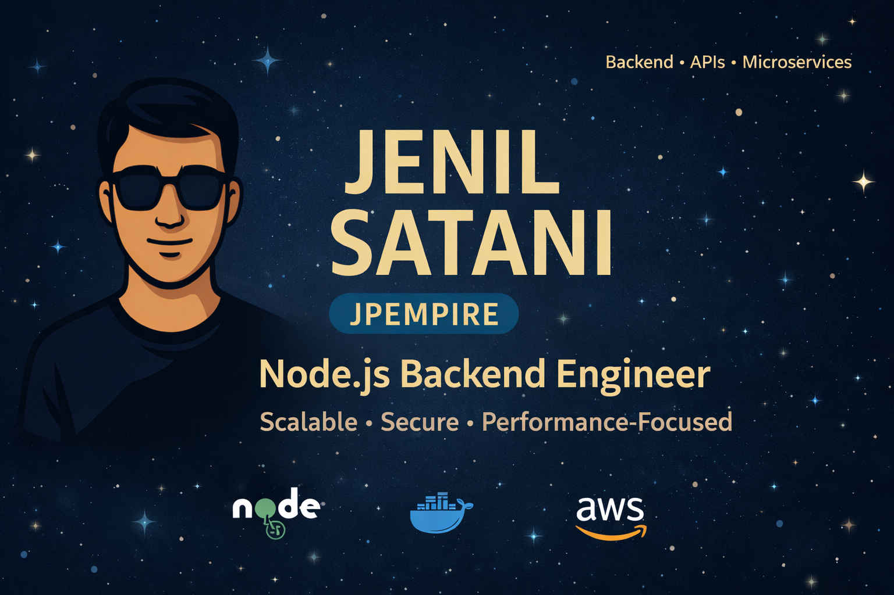

  <h1>🌟 Jenil Satani</h1>
  
<b>Node.js Backend Developer | Scalable APIs | Clean Architecture</b>

  

    
  

  

    
  

  

    
    
    
  

---

### 👋 About Me

I am a results-oriented **Node.js Backend Developer** passionate about engineering high-performance, secure, and scalable backend architectures. I specialize in designing clean APIs, optimizing database queries, and leveraging modern backend patterns to solve real-world complexities.

- 💻 **Core Belief**: Code should be readable, testable, and built to scale.
- 🚀 **Focus Areas**: API design, database normalization/optimization, and performance tuning.
- 🤝 **Collaboration**: Thriving in agile environments, working closely with frontend engineers to deliver seamless experiences.

---

### ⚡ Technical Expertise

| Category | Technologies |
| :--- | :--- |
| **Languages** |     |
| **Frameworks & Libraries** |     |
| **Databases & Caching** |     |
| **ORM & ODM** |    |
| **Testing Utilities** |    |
| **DevOps & Cloud** |     |
| **Architectures & Tools** |     |

### 📊 GitHub Activity & Statistics

  
  

---

### 📚 Learning Roadmap
*   🏗️ **System Design**: Deep diving into high-availability architecture patterns.
*   🚀 **Container Orchestration**: Exploring Kubernetes and production serverless configurations.
*   🔒 **Advanced Security**: Implementing OAuth 2.0 & identity federation patterns.
*   ⚡ **API Paradigms**: Developing high-performance microservices with GraphQL & gRPC.

---

### 🤝 Connect with Me

  
  
  
  
  

---

  <i>"Any fool can write code that a computer can understand. Good programmers write code that humans can understand."</i> 
  — <b>Martin Fowler</b>

  ⭐️ Star this repository if you find my work helpful!

