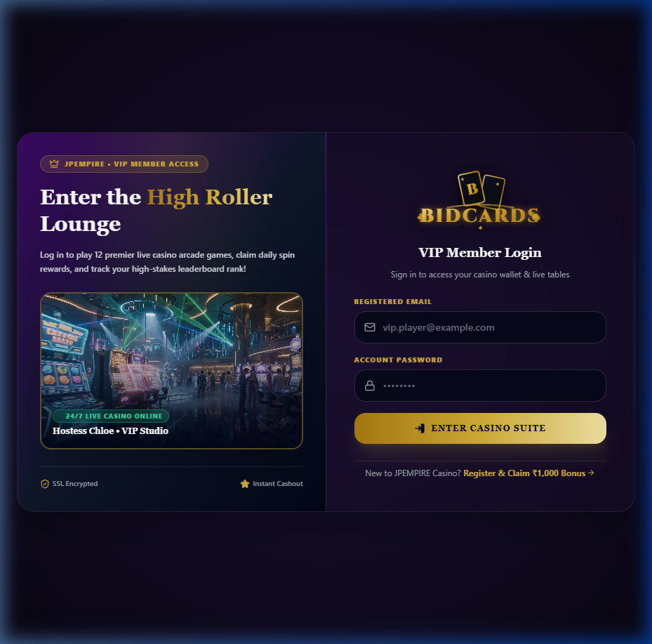

# 📂 Projects Directory

Welcome to my projects portfolio! Here you will find detailed engineering write-ups of the platforms and architectures I have designed and implemented.

---

## 🎰 BidCards — Premium Card Bidding & Casino Arena

### 🔗 Quick Links
- **Live Deployment:** [https://bid-cards.vercel.app/](https://bid-cards.vercel.app/)
- **Primary Showcase Banner:** [assets/bid_cards.png](../assets/bid_cards.png)

---

### 📖 Project Summary
**BidCards** is an exclusive VIP High-Roller card bidding and live casino arcade platform. It allows players to participate in real-time card auctions, play high-stakes casino games, claim daily rewards, and track their performance on a live, global leaderboard.

As a Node.js Backend Developer, the focus was to design a highly scalable, secure, and performant backend capable of processing high-frequency bids and managing real-time game loops with sub-second latencies.

---

### 🚀 Key Technical Features

#### 1. Real-time Event Loop (WebSockets)
- Implemented bidirectional event handling via **Socket.io** to synchronize bids, wallet state changes, and live arcade results instantly across multiple concurrent clients.
- Achieved sub-100ms latency for bid broadcasts, preventing synchronization inconsistencies in fast-paced card bidding rooms.

#### 2. High-Performance Caching & Leaderboard Engine
- Utilized **Redis Sorted Sets (`ZADD`, `ZRANGE`, `ZREVRANK`)** to handle high-write operations for the global high-stakes leaderboard, ensuring instantaneous ranking computations without overloading the database.
- Implemented Redis caching for active bidding sessions and user session validations.

#### 3. Secure Financial & Wallet State
- Designed transactional safety measures to manage digital player wallets, preventing double-spending and race conditions during simultaneous bids and withdrawals.
- Integrated validations for instant deposits and cashouts.

#### 4. Cryptographic Authentication & Authorization
- Built secure **JWT-based authentication** with token rotation and short-lived access tokens to protect the High-Roller VIP area and endpoints.
- Role-based authorization for VIP Member Access.

---

### 🛠️ Technology Stack & Tools

- **Backend Architecture:** Node.js, Express.js, Socket.io
- **Database Layer:** MongoDB (for persistent player profiles & gaming records), Redis (for session caching & sorted set leaderboard)
- **Frontend UI:** React, Vite, HTML5, Vanilla CSS3 (Custom Glassmorphism theme with cinematic animations)
- **Deployment & Ops:** PM2 process manager, AWS EC2, and Vercel for the frontend bundle

---

### 📸 Interface Preview
Below is the High-Roller Lounge VIP login and gateway:

  

